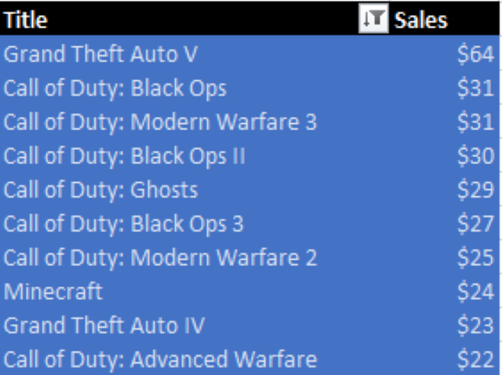
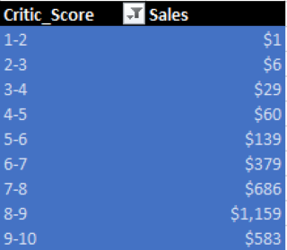

# Global Video Game Sales Analysis


## Introduction
A Microsoft Excel project featuring an interactive dashboard that examines, analyzes, and visualizes the sales performance and growth trends of game titles in the global video game industry. The project provides intelligent insights into various aspects of video game sales, including regional performance, console distribution, and genre popularity, to enhance game development and strategic sales decision-making.

## Table of Content
- [Project Overview](https://github.com/DannyAlao/Global-Video-Game-Sales-Analysis-Project?tab=readme-ov-file#project-overview)
- [Project Objectives](https://github.com/DannyAlao/Global-Video-Game-Sales-Analysis-Project?tab=readme-ov-file#project-objectives)
- [Document Purpose](https://github.com/DannyAlao/Global-Video-Game-Sales-Analysis-Project?tab=readme-ov-file#document-purpose)
- [Skills Demonstrated](https://github.com/DannyAlao/Global-Video-Game-Sales-Analysis-Project?tab=readme-ov-file#skills-demonstrated)
- [Data Source](https://github.com/DannyAlao/Global-Video-Game-Sales-Analysis-Project?tab=readme-ov-file#data-source)
- [Data Processing and Modification](https://github.com/DannyAlao/Global-Video-Game-Sales-Analysis-Project?tab=readme-ov-file#data-processing-and-modification)
- [Data Analysis and Insights](https://github.com/DannyAlao/Global-Video-Game-Sales-Analysis-Project?tab=readme-ov-file#data-analysis-and-insights)
- Data Visualization
- Recommendations
- Conclusion

## Project Overview
This is an analytical undertaking that provides an in-depth, holistic and concise insights on the global video-game ecosystem from a comprehensive dataset exploring sales, industry’s growth trends, regional performance of game titles overtime from North America, Japan, the EU, Africa, and the rest of the world for thirty-six thousand, seven hundred and fourteen (36,714) unique video game titles released from 1971-2024, including information like developers, publishers, critic's score, genres, consoles, and more. Using Microsoft Excel as a tool for analysis and visualization, insights and recommendations from this analysis would provide stakeholders and industry experts with relevant knowledge and requisite information on the dynamics of the video game industry with the aim to enhance data-driven and strategic decision-making for both economic and social benefits of the global video game ecosystem.

## Project Objectives
This project is committed to answering four (4) core questions about the global video game industry. Highlighted below are the guiding objectives for the analysis:
- **Video game titles that sold the most worldwide**: Video game titles with the most global presence in terms of revenue generated, unearthing key likely factors responsible for specific video game titles’ ascendancy on the global video game sales chart. 
- **Year with the highest sales and industry growth over time**: It becomes germane to examine periods in which the most and the least game titles were sold and more importantly, noticeable growth patterns and trough trends- identifying both arithmetic and exponential peaks and declines with commensuration between the number of video game titles sold and the revenue generated from the sales of video game titles in the over five decades of the global video game industry’s existence.
- **Consoles’ dominance in a particular genre**: To unravel whether specific video games consoles specialized in a particular genre, likely reasons for such console-genre specialization and subsequent influence on games development and consumer preference. 
- **Regional sales juxtaposition of video game titles**: To identify regional sales performance of specific video game titles across the globe drawing a line for sales performance comparison of top selling video game titles and uncover titles that are popular in certain regional markets but underperformed in others, highlighting income contribution of each region to the overall global income generated by the video game industry.

## Document Purpose
This documentation serves as a guide for stakeholders in the video game ecosystem, providing detailed-insights into the project's objectives, data source, data analysis, visualizations, and other relevant information.

## Skills Demonstrated
In the course of this project, the following Microsoft Excel features were incorporated: 
- Data processing and modification, 
- Filters, 
- Data analysis, 
- Data visualization

## Data Source
The data source for the project is a CSV (comma-separated value) file dataset downloaded from  website, containing pertinent and updated information about global video game sales. 
The dataset has fifty-nine thousand, nine hundred and sixty-six (59,966) rows and fourteen (14) columns. Excluding the URL column containing information not directly relevant to the analysis at hand, the columns are: Title, Console, Genre, Publisher, Developer, Critic Score, Total Sales (in millions), Sales Breakdown by Region (North America, Japan, PAL, Other), Release Date, and Last Update. 

## Data Processing and Modification
Checking through the video game sales dataset, no duplicate values were found. However, there are null values in columns such as Total-sales, Critic-score, North-American Sales, Japanese Sales, European-African Sales, Other-regions sales and Last-Update. While maintaining the principle of data quality, consistency and accuracy, for the sake of getting in-depth insights from this analysis, four (4) additional columns were created to contain information on Regions, Cumulative Sale per Region, Year, and Decade, extracted from existing columns in the dataset. The dataset used for this project after modification contains eighteen (18) columns in total.

Here are the definitions of each column:
- Title - contains different game titles; 
- Console - Console or platform on which consumer can access the game; 
- Genre - Genre of the game; 
- Publisher - Publisher of the game;
- Developer - Developer of the game; 
- Critic Score - Metacritic score (out of 10); 
- Total Sales - Global sales of copies in millions;
- Na Sales - North American sales of copies in millions;
- Jp Sales - Japanese sales of copies in millions; 
- Pal Sales -European & African sales of copies in millions; 
- Other Sales - Rest of the world sales of copies in millions; 
- Release Date - Date the game was released;
- Last Update - Date the data was last updated
 
The four additional columns contain the following information:
- Regions – global locations of video game audience; 
- Cumulative Sales per Region – sum of sales from each region that made up the total global sales; 
- Year – the year game title was released; 
- Decade – periodic grouping of video game titles extracted from the release-date column 

## Data Analysis and Insights
First and foremost, the objective of this analysis is to provide business intelligence and insights on the top-selling video game titles worldwide. Secondly, it aims to determine the year with the highest number of video game titles sold and the corresponding revenue generated. Additionally, the analysis seeks to identify trends in video game sales and industry growth over time, highlighting notable periods of growth and decline.

The analysis also includes console grouping by genre to assess video game title sales performance based on console-genre specialization. This involves examining sales performance in terms of volume and revenue generated by specific consoles across different genres. Furthermore, it compares aggregated video game title sales by region, with detailed consideration of both top and least-selling titles with reference to quantity sold and revenue generated.
In other words, the analysis prioritizes identifying the reasons behind the sales performance and revenue disparities among different regions.

**This analysis provides answers to the following questions**:

**1. Which titles sold the most worldwide?** 

This analysis examines video game titles with the highest total sales, and more importantly, global appeal. To identify video game titles that sold the most worldwide in Microsoft Excel, firstly, a pivot table was used to calculate the total global income made by the video game industry from game titles sold. Secondly, a top ten (10) filtered pivot table comprising titles and count-of-sales was created and visualized using pivot chart (bar chart) to display the results.

*Pivot table for the total global income from game-titles generated by the video game industry*

|Total Sales of Video Game Titles|
:--------------------------------:
|$6,599.32|

The pivot table analyzes the top ten (10) selling video game titles worldwide, providing a clearer understanding of the sales performance of titles that best met consumers' needs.

*Pivot table results for the top-selling video game titles worldwide*


The pivot chart(bar chart) displays a graphical analysis of the top ten (10) selling video game titles worldwide, providing a clearer understanding of the sales performance of titles that best met consumers' needs.

*Pivot chart (bar chart) results for the top-selling video game titles worldwide*


- As a result of the analysis done, ‘Grand Theft Auto’, ‘Call of Duty’ series, and ‘Minecraft’ are the top selling video game titles, generating commensurate income for the industry worldwide. This is a strong indication of their global acceptability by a wide range of video-game consumers and their strong standing in the global video game market. This success could be attributed to the quality and user-friendliness of the consoles and genres they belong to, and by extension, consumers’ preferences.

In an attempt to dig deeper and make this analysis more insightful, further effort was made to compare video game title sales and critic scores using the critic-score column in the dataset with a meta-critic scale of 1-10. The goal was to identify whether a correlation exist between critic-score of game titles and their sales. This correlation was examined by creating two (2) pivot tables: one to calculate the average critic-score and another to sum of total sales. Additionally, and a pivot chart – column chart was created for visualization.

*Pivot table displaying the average critic score of top-selling video game titles*

|Average Critic_Score|
:--------------------:
|7.22|

This pivot table shows the correlation between critic scores and total sales of video game titles, indicating how critics' reviews of game features influence and shape revenue generation.

*Calculated pivot table results illustrating the correlation between video game sales and critic scores using the Metacritic scale of 1-10*



Pivot chart (column chart) illustrating the correlation between critic scores and video game sales, providing a deep understanding of the influence critic scores have on overall sales and revenue patterns in the gaming industry.

*Pivot chart (column chart) results displaying the correlation between critic scores and video game sales*


- This analysis showed that top selling video game titles have an average critic-score of ‘7.2’. Similarly, it was discovered that the higher the critic score of a particular video-game title, the higher the income generated from the sales of such video game titles.
- Video game titles with Metacritic scores of 8-9 sold the most and generated the highest revenue in the video game industry over time. 
- It was factually established that video game titles with critic score of 5 and above sold the most and made more revenue while video game titles below 5 critic-score had lower sales and income respectively. This means game titles with higher critic score had the most sales and generated the most income compared to game titles with low critic score.

**2. Which year had the highest sales? Has the industry grown over time?** 

This identifies the year with the highest sales from video-game titles, taken into consideration both volume and revenue, trends and patterns of the video game titles sold over a period of time. A detailed time-series examination of noticeable changes in the sales of game titles and significantly, how the video game industry has wholesomely fared over time based on the information in the dataset. To achieve this set objective in Microsoft Excel, expectedly, total revenue generated globally by the video game industry has to be known. To calculate global revenue of video game titles, a pivot table was created to sum the total sales column in the dataset.


*Pivot table for the total global income from game-titles generated by the video game industry*

|Total Sales of Video Game Titles|
:--------------------------------:
|$6,599.32|

Furthermore, in view of identifying the year with the highest video game sales in Microsoft Excel, a formula was adopted to extract year from the release-date column in the dataset.

*Microsoft Excel formula to extract year from the release date of video games*

``` YEAR(Release Date) ```

After extracting the year, a pivot table was created to calculate the top ten (10) years with the highest sales of video game titles and their total sales. Additionally, a pivot chart (line chart) was used to graphically visualize the sales patterns of game titles over time, providing a clear answer to the question of which year had the highest sales.

*Pivot table showing top ten (10) years with the highest video game title sales globally*


*Pivot chart (line chart) used to analyze global video game title sales patterns over time*


- The analysis shows that the highest sales of video game titles occurred in 2008. Although 2009 had the highest quantity of video game titles sold, the revenue generated that year was relatively lower compared to 2008, which had fewer titles sold but generated higher income for the video game industry.
- In addition, despite significant growth from the late 1990s through the 2000s, 2010 marked a drastic decline in global video game title sales, indicating possible market saturation or shifts in consumer behavior toward different video game titles.

To better understand industry growth trends, further analysis was conducted on video game title sales by decade to uncover growth patterns over the years. In Microsoft Excel, a decade column was created and populated with information extracted from the release-date column. A pivot table was then generated, containing data on sales sums and counts by decade, and combined with a pivot chart (column chart) to clearly display sales trends and patterns in the video game industry.

*Microsoft Excel formula employed to extract decade from the release-date column in the dataset*

```FLOOR(YEAR(Release Date), 10) ```

*Pivot tables showing the sum of sales (revenue generated) and the count of video game titles sold per decade in the video game industry over time*

Sum of Sales                                     |                                Count of Sales
:------------------------------------------------|----------------------------------------------:
                          | 

To identify growth trends and patterns in global video game sales over time, a pivot chart (column chart) was used to highlight periods of growth and decline in both sales and volume of video game titles in the gaming industry worldwide.

*Pivot chart (column chart) used to display global video games decadal sales and growth patterns*


- This analysis helps to reveal that the industry’s sales grew considerably in the first four (4) decades, with the 2000s’ decade sitting at the top of the pile in both volume of video game titles sold and revenue generated. 
- Comparatively, current decade (2020) is experiencing a sharp nosedive in both quantity of video game titles sold and revenue generated which might be due to the global socio-economic volatility and change in video game consumers’ preference. 

**3.	Do any consoles seem to specialize in a particular genre?**

This is an attempt to determine and unravel the possibility of having specific consoles specializes in specific genres with attendant dominance in video game titles sold and revenue. In the context of this analysis, identifying consoles with huge dominance in specific genres using Microsoft Excel, a pivot table was created to filter top ten (10) consoles and genres showing the interactive relationship that subsist between video game consoles and genres. To visualize console-genre specialization, a pivot chart (column chart) was created to display results.

*Pivot table displaying top ten (10) console-genre specialization*


To enhance the graphical representation of console-genre specialization, a pivot chart (column chart) is used to display the results of the top ten (10) consoles-genres specialization.

*Pivot chart (column chart) for top ten (10) consoles-genres specialization*


- This analysis revealed that console like ‘DS’, ‘PC’, ‘PS’, ‘PS2’, ‘PS3’, ‘PS4’, ‘PSN’, ‘PSP’, ‘GBA’, and ‘XBL’ are topping the video game sales chart in ‘Action’, ‘Adventure’, ‘MISC’, ‘Puzzle’, ‘Racing’, ‘Role-Playing’, ‘Shooter’, ‘Simulation’, ‘Sports’, and ‘Strategy’ genres respectively. 
- ‘PC’ console clearly came top across the top ten (10) genres excluding sports where ‘PS2’ exhibits clear dominance. This is clearly a significant indication that consumers’ preference for consoles is variegated along genres lines. 
- Out of the top ten (10) filtered consoles adopted to check for possible console-genre niche in this analysis, ‘DS’, ’PC’, and ‘PS’ consoles asserted their dominance in the ‘MISC’ genre, leaving other consoles in the lower rung of this particular genre.

**4.	What titles are popular in one region but flop in another?**

The video game industry is globally divided into four (4) markets: North-American, Japanese, European-African, and Other-regions. This analysis examines the sales performance of video game titles with reference to both the volume of titles sold and the revenue generated, considering the cumulative revenue of game titles sold worldwide. To analytically identify video game titles with either high or low sales performance in any of the four global markets using Microsoft Excel, two pivot table were created. These tables calculate and display the top ten (10) filtered video game titles sold, containing information on titles and their total sales in the North-American, Japanese, European-African, and Other-regions, as well as percentage contributed by each regional video game market to the global income generated by the industry.  To visualize this regional sales performance, a pivot chart (column chart) was created to display the sales performance of video game titles over time in the four (4) regional video game markets.

*Pivot table analyzing the regional sales performance of the top ten (10) filtered video game titles*


*Pivot table analyzing the regional percentage sales performance of the top ten (10) selected video game titles*


In order to identify the regional sales performance of video game titles across four regional markets, a column chart and a pie chart are used to display these sales disparities.

*Pivot chart (column chart) for top ten (10) performing video game titles across four regional markets*


*Pivot chart (pie chart) displaying the percentage contribution of each of the four (4) regional video game markets to total revenue*


- This analysis shows that video game titles like ‘Grand Theft Auto V’, and ‘Call of Duty’ series performed excellently well in North-American and European-African but flopped in the Japanese and Other-region markets; an apparent pointer to the huge presence of video games consumers in both North-American and European-African regions which in turn translated into huge commensurate revenue generated for those video game titles contributing larger share to the global video game income. 
- The North American and European-African video game markets contributed the highest percentages of sales to global video game industry revenue.
- This analysis revealed that video game title like ‘Guitar Hero III: Legends Rock’ recorded high sales and huge consumer presence in the North-American market but flopped in the remaining three regions (European-African, Japanese, and Other-regions). 
- The analysis shows that video game titles with high sales performance in the North-American and European-African regions had low sales majorly in the Japanese and other-regions markets. This could be due to a combination of factors, including genre and console preferences of consumers, as well as cultural elements and context specific to each region.

## Data Visualization 

This data visualization was created using Microsoft Excel, specifically utilizing pivot tables and pivot charts. Each visual representation is designed to address specific questions central to the project objectives, providing insights and facilitating a deeper understanding of the dataset while closely aligning with the project's goals.


You can also interact with the report [here](Global-Video-Game-Sales-Analysis-Project.xlsx)

## Recommendations

Here are some actionable recommendations meticulously-derived from this analysis, guided by the core objectives of the video game sales project.

**1. Top selling video game titles worldwide**

- Developers of top-selling video game titles like 'Grand Theft Auto,' the 'Call of Duty' series, and 'Minecraft' should leverage and consolidate their current strategies for global dominance in the video gaming industry to convert potential consumers into actual consumers.
- Investing and paying serious attention to continuous innovation and incorporating advance technology to better their game titles to meet their teeming consumers preferences.
- Sustain top sales performance by regularly improving video game designs to align with consumer preferences, driving increased revenue generation.
- Regularly engage with consumers to identify areas of the interface that can be improved for a better user experience, maintaining consumer satisfaction through a sustained feedback mechanism.

**Note**: Unlike top-selling video game titles, there are others that exhibit poor performance in terms of both sales and revenue. In this analysis, these underperforming titles are referred to as 'worst-selling video game titles.' Below, I outline several recommendations for improving the performance of games that fall into this category.

**2. Year with the highest title sold**

- Given that 2008 was the peak year for revenue, followed by a decline, it is essential to prioritize meticulous research and analysis to identify the factors contributing to this significant decrease in both sales volume and revenue of video games over time.
- A comprehensive survey targeting the video game consumer base should be conducted to uncover factors contributing to declines in sales volume and revenue.
- Critical stakeholders, including developers and publishers, should collaborate with industry experts to design data-driven strategies. These strategies should incorporate successful elements from 2008 to improve console and genre development, meeting current consumer preferences and increasing income for the global video game industry in line with current socio-economic realities.
- Additionally, promotional campaigns highlighting the psychological benefits of video games, such as cognitive improvement, emotional resilience, a sense of achievement, and stress relief, should be considered.

**3. Consoles’ specialization in specific genres**

- Video game titles on consoles with strong presence and dominance in a particular genre can consolidate and expand their reach to other genres by enhancing console features to satisfy diverse consumer preferences.
- In genres where they lack dominance or have shown poor sales performance, strategies should be developed to drive improvement in creating top-notch genres. This can be achieved by providing consumers with a wide variety of options for maximum satisfaction through improved software and hardware components across different video game titles.
- Video game developers can implement innovative strategies to incorporate elements from multiple genres, creating unique designs and gaming experiences that will sustain the current consumer base and attract a broader audience.

**4. Titles popular in one region but flop in another**

- Game titles that perform well in one or more regions should consolidate their dominance by enhancing console features and improving genre quality. This will ensure sustained presence in these regions, providing consumers with high levels of satisfaction, resulting in increased sales and revenue.
- Conduct a comprehensive review of video game designs for both top and least-selling titles across extant regional markets to identify potential areas for improvement.
- In regions where game titles have underperformed, developers should review current sales strategies, conduct market research, and perform sales analysis to identify key factors (economic, socio-cultural, or religious) affecting performance. 
- Adapt successful strategies to drive improved sales, attract more consumers, address consumer preferences, and enhance the overall gaming experience by leveraging emerging opportunities to align game creation with both regional and genre preferences.

## Conclusion

The analysis delves into key information about the overall sales and dynamic competitiveness of the global video game industry. Actionable insights from this analysis will be valuable to stakeholders, developers, publishers, and industry analysts. These insights can help improve the video game experience and cater to consumer preferences to maintain the current consumer base, while also converting potential consumers into actual buyers, leading to an upward trajectory in both the volume of titles sold and revenue worldwide.

Thank you for taking the time to read through this.

I am a budding Data Analyst with a passion for learning and growth. I am seeking an internship opportunity where I can apply my skills and take on challenging responsibilities to further my development and contribute to the organization's success by providing intelligent and actionable insights for better decision-making.

For questions, feedback, or collaboration opportunities, you can reach me via [alaomoradeyod@gmail.com](email) or [LinkedIn](www.linkedin.com/in/daniel-alao)

THANK YOU
